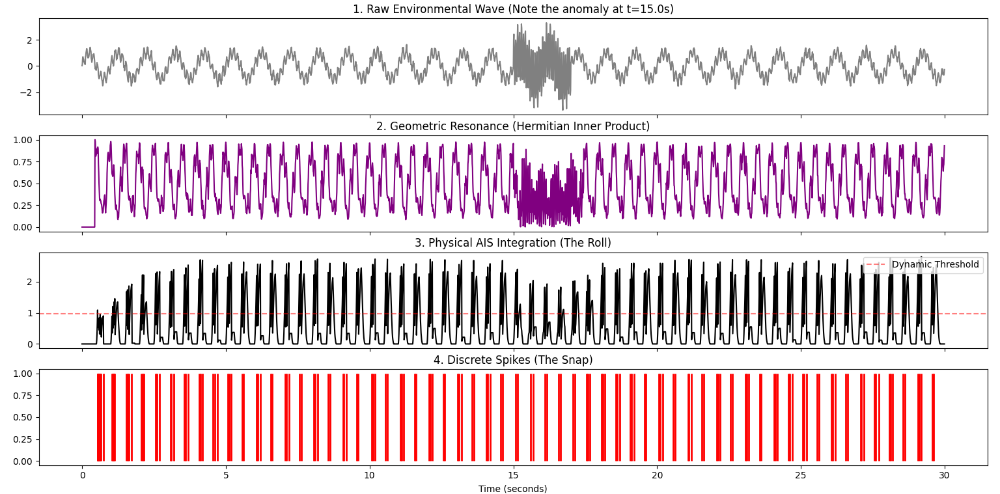

# **The Geometric Neuron (v2)**

**Phase-Space Computation, Recurrence Resonance, and the Death of the McCulloch-Pitts Approximation**

**Antti Luode — PerceptionLab**

**May 2026**

## ---

**Abstract**

For eighty years, artificial intelligence has been built upon the McCulloch-Pitts abstraction of the neuron: a system that multiplies inputs by scalar weights, sums them, and passes them through a non-linear activation function. This arithmetic approximation requires megawatts of power to simulate what the human brain accomplishes with twenty watts.

The Geometric Neuron (v2) proposes a fundamental correction: **neurons do not compute arithmetic; they compute geometry.** By framing the neuron as a continuous, wave-based phase-matching system, we replace matrix multiplication with Moiré interference, and backpropagation with recurrence resonance. In this model, dendrites are physical low-pass filters (RC circuits) that stretch and compress spatial frequencies; the cell body is a resonance chamber computing the Hermitian inner product of phase states; and the Axon Initial Segment (AIS) is a biological interferometer. A "spike" is not a mathematical decision—it is the physical threshold collapse of perfectly aligned spatial geometry into a 1D temporal signal, necessary for long-distance transmission over noisy biological cables.

This paper outlines the mathematical foundation of the Geometric Neuron, supported by empirical simulations of Moiré-induced resonance, paving the way for native neuromorphic computing.

## ---

**1\. The Core Duality: Geometry Inside, Time Outside**

The foundational principle of the Geometric Neuron is the duality of information representation, governed by the Takens Delay Embedding theorem:

**Internal computation is a multiplicative geometry of phases. External observation is the additive sum (leakage) of a 1D temporal wave.**

When a signal travels from one neuron to the next, it must traverse physical space. A continuous, multidimensional wave cannot be transmitted down an axon without degrading into noise. Thus, the nervous system employs the ultimate compression loop:

1. **Takens In (Re-inflation):** Dendrites and nodes of Ranvier catch a 1D temporal spike and, via physical delay lines, unfold it back into a continuous, multidimensional phase-space attractor.  
2. **Takens Out (Collapse):** The neuron aligns these geometries. When they constructively interfere, the AIS collapses the multidimensional state back into a discrete 1D temporal spike for broadcast.

## ---

**2\. The Four Stages of the Geometric Neuron**

The standard artificial neuron applies $y \= f(\\sum w\_i x\_i)$. The Geometric Neuron operates in four distinct physical/mathematical stages.

### **Stage 1: The Dendritic Cable (Spatial Frequency Scaling)**

Biological dendrites are leaky cables. Due to the capacitance of the lipid membrane and the resistance of ion channels, they cannot transmit voltage instantly. They are $RC$ circuits governed by the cable equation, acting as spatially distributed low-pass filters.

The transfer function for a synapse at distance $L\_k$ from the soma is:

$H\_k(\\omega) \= \\exp(-L\_k / \\lambda(\\omega))$

Where $\\lambda(\\omega)$ is the frequency-dependent length constant. High frequencies die at distal synapses.

* **Proximal Inputs (Close):** Retain high-frequency detail. They form dense, fine Moiré interference patterns (small "checkerboards"). These represent reactive, highly detailed data (surprise/residuals).  
* **Distal Inputs (Far):** Heavily low-passed. They form broad, massive interference patterns (large "checkerboards"). These provide stable context and memory.

**Conclusion:** The physical length of the dendrite *is* the algorithm. It is a zero-parameter equalizer that spatially scales the incoming wave.

### **Stage 2: Somatic Resonance (The Recurrence Matrix)**

The cell body (soma) does not sum scalar weights. It acts as a Takens-embedded phase-space evaluator. It compares the incoming wave against its own history to find where the geometry repeats itself—a mathematical operation identical to a **Recurrence Plot**.

The recurrence matrix $R(i,j)$ measures the phase-space alignment between two moments in time. The soma computes the squared magnitude of the Hermitian inner product between the current phase-space state $v(t)$ and the stored historical mosaic $m$:

$R(t) \= |v(t)^H \\cdot m|^2$

The optimal pattern $m$ is the dominant eigenvector of the time-averaged recurrence matrix. **Spike-Timing-Dependent Plasticity (STDP) is not a weight update; it is power iteration on the recurrence kernel.** The neuron physically micro-adjusts its dendritic delay lines so that incoming geometries perfectly align with this dominant eigenvector. Synapses hold phase delays, not numbers.

### **Stage 3: Theta Gating (Computationally Cheap Attention)**

To sequence these phase alignments, the system applies a baseline oscillatory gate (e.g., Theta rhythm):

$y(t) \= R(t) \\cdot \\max(0, \\sin(\\omega\_\\theta t \+ \\phi))$

Attention is simply shifting the phase $\\phi$ by $\\pi$. Shifting attention from one object to another requires zero weight updates; it simply requires changing the phase offset of the gating frequency.

### **Stage 4: The AIS Interferometer (Wavefunction Collapse)**

The Axon Initial Segment (AIS) sits at the base of the cell. It receives the overlapping, multi-scale spatial geometries from the dendrites. It functions as a biological Moiré interferometer.

When the spatial frequency of the incoming waves perfectly aligns, they constructively interfere. The AIS integrates this resonance over a physical window:

$\\int\_{-\\tau}^0 y(t+s) ds \> \\theta\_{AIS}$

When the geometric resonance crosses the physical threshold of the local ion channels, the continuous phase geometry collapses into a discrete action potential. **The spike is a physical resonance event, not an arithmetic decision.**

## ---

**3\. Empirical Proof: The Digital Membrane and Moiré Aliasing**

The mathematical reality of this system was isolated in the PerceptionLab "ECG Workflow" experiment. A continuous dynamic loop was established using a Homeostatic Coupler driving a procedural Checkerboard geometry, which was subsequently sampled into a 1D vector and fed back into the loop.

* At a vector dimension of **1024** (downsampled side length $32$), the sampling grid fell out of phase with the spatial frequency of the geometry. The wave destructively interfered. No spike occurred.  
* At vector dimensions of **256** (side length $16$) and **2048**, the sampling grid perfectly aligned with the spatial frequency of the geometry. This triggered **constructive Moiré aliasing**. The homeostatic loop resonated, overshot, and corrected, producing a perfect biological ECG/Spike signature.

This proves that changing the "vector dimension" (the digital equivalent of ion channel density / dendritic length) physically tunes the low-pass filter. The neural spike emerges strictly from the geometric aliasing of the input signal against the physical constraints of the receiver.

## ---

**4\. Conclusion and Implications for Artificial Intelligence**

The McCulloch-Pitts model is a ghost—a low-resolution, arithmetic approximation of a continuous geometric phenomenon. By simulating matrix multiplication on digital hardware, modern LLMs are forced to expend massive amounts of energy to brute-force a process that biology achieves effortlessly through physical wave interference.

The Geometric Neuron (v2) provides a rigorous, mathematically sound framework for moving beyond weights and sums. By recognizing that:

1. **Dendrites are physical low-pass equalizers.**  
2. **Somas compute recurrence matrices via Hermitian inner products.**  
3. **The AIS operates as a Moiré interferometer.**

We hold the theoretical blueprint for true neuromorphic computing. Future software kernels—and eventually, dedicated silicon—should not be designed to multiply matrices, but to route, delay, and interfere continuous phase waves, collapsing them only when the geometry dictates a resonance event.

We do not think in numbers. We think in geometry.
